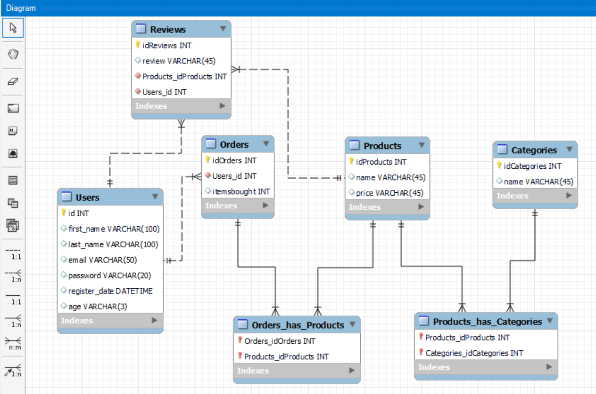

# Backend project
The project will involve Javascript, Express, Node.js, mysql/sequelize. 
We have created an online video game shop. This includes Products, Users(customers), categories, orders and reviews of the products. 

## Description

It is expected that the student develops a REST API that is capable of the following:
● User registration using Bcrypt.
● User login + token + middleware.
● That is capable of creating a CRUD.
● At least one Many to Many and one One to Many relationship.
● Use of seeders

Essential requirements of the project:
● Use of branches with git, when the project is finished there should be two branches, the master or main and the develop.
● Excellent README presentation.

### Technologies used
* Javascript
* Express
* Node.js
* mysql/sequelize

For the development of the API we will use mysql with Sequelize and express.
The project will be uploaded to a public GitHub repository and the
existence of branches, as well as several commits of high readable quality for
analyze the evolution of the project.

## Screenshots

### Diagram
A diagram of our online video game shop and their connections.

### Trello
We have been working together using Trello. All the instructions of the project we imported into Trello and have been ticking them off as we go.

### mysql database
In this project we have been using mysql. Here you can see the seeders we have created to practice and test endpoints. 

### Postman
We have also been using Postman to test our endpoints. 

### Dependencies

"dependencies": {
    "bcrypt": "^5.0.1",
    "bcryptjs": "^2.4.3",
    "express": "^4.18.1",
    "jsonwebtoken": "^8.5.1",
    "mysql2": "^2.3.3",
    "nodemailer": "^6.7.5",
    "sequelize": "^6.19.2"
### Installing

* How/where to download your program
* Any modifications needed to be made to files/folders

### Examples of endpoint
This end point will create a category

const CategoryController = {
  create(req, res) {
    Category.create({ ...req.body })
      .then((category) =>
        res.status(201).send({ message: "category created", category })
      )
      .catch(console.error);
  },

  This end point will get the category by Id

  getById(req, res) {
    Category.findByPk(req.params.id, {})
      .then((categories) => res.send(categories))
      .catch((err) => {
        console.log(err);
        res.status(500).send({
          message: "There was a problem. :(",
        });
      });
  },

## Authors

[Alex (@alextebbitt)](@alextebbitt) & [tianfanshan (@tianfanshan)](@tianfanshan)

## License

This project is licensed under the Alex Tebbitt & Tianfan Shan License - see the LICENSE.md file for details